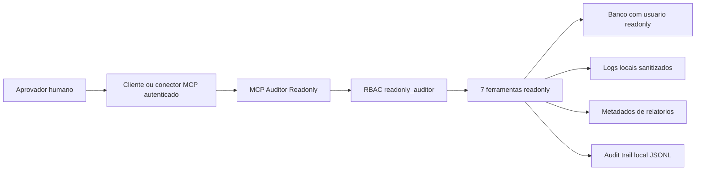

# ORKIO MCP Auditor Readonly - Fase 1

## Estado

Produção permanece bloqueada.

Este pacote descreve somente o MCP Auditor readonly. Ele não inclui MCP Dev, não cria rota de deploy, não executa migration, não altera usuários, não altera secrets e não deve acessar conteúdo bruto de mensagens ou documentos.

## Objetivo

Disponibilizar um servidor MCP defensivo para auditoria operacional com sete ferramentas readonly:

- `get_health()`
- `get_recent_logs_sanitized()`
- `get_thread_metadata()`
- `get_message_counts()`
- `get_file_refs()`
- `get_runtime_flags()`
- `get_audit_reports()`

## Garantias de Fase 1

- Não escreve em dados de produto.
- Não cria, altera ou remove usuários.
- Não executa migrations.
- Não executa deploy.
- Não expõe mensagens integrais.
- Não expõe conteúdo extraído de arquivos.
- Não expõe embeddings.
- Não expõe senhas, tokens, cookies, chaves ou connection strings.
- Gera audit trail local sanitizado de cada chamada.
- Exige escopo RBAC `readonly_auditor`.
- Exige escopo por organização quando configurado.

## Modelo de Arquitetura



## Estrutura de Arquivos

```text
mcp_servers/
  auditor_readonly/
    __init__.py
    audit_trail.py
    auth.py
    config.py
    limits.py
    queries.py
    rbac.py
    sanitizers.py
    schemas.py
    server.py
    tools.py
tests/
  mcp_auditor_readonly/
    test_auth.py
    test_no_content_leak.py
    test_sanitizers.py
    test_tools_contract.py
docs/
  ORKIO_MCP_AUDITOR_READONLY_README.md
  ORKIO_MCP_AUDITOR_READONLY_SECURITY.md
requirements-mcp-auditor-readonly.txt
ORKIO_MCP_AUDITOR_ENV_VARS.txt
ORKIO_MCP_AUDITOR_VALIDATION_CHECKLIST.txt
```

## Instalação Manual

1. Criar branch de revisão.

```bash
git checkout -b orkio-mcp-auditor-readonly-fase1
```

2. Copiar os arquivos propostos para os caminhos indicados.

3. Instalar dependências apenas em ambiente local ou CI isolado.

```bash
python -m pip install -r requirements-mcp-auditor-readonly.txt
```

4. Configurar variáveis de ambiente em mecanismo seguro do ambiente local ou staging administrativo.

5. Manter `ORKIO_MCP_AUDITOR_ENABLED=false` até concluir revisão e testes.

6. Executar testes unitários localmente.

```bash
python -m pytest tests/mcp_auditor_readonly
```

7. Ativar manualmente apenas em ambiente autorizado.

```bash
export ORKIO_MCP_AUDITOR_ENABLED=true
python -m mcp_servers.auditor_readonly.server
```

## Configuração MCP

Exemplo conceitual para cliente MCP local:

```json
{
  "mcpServers": {
    "orkio-auditor-readonly": {
      "command": "python",
      "args": ["-m", "mcp_servers.auditor_readonly.server"],
      "env": {
        "ORKIO_MCP_AUDITOR_ENABLED": "true",
        "ORKIO_MCP_AUDITOR_EXTERNAL_AUTH_REQUIRED": "true",
        "ORKIO_MCP_AUDITOR_PRINCIPAL_ID": "mcp_auditor_readonly",
        "ORKIO_MCP_AUDITOR_ROLE": "readonly_auditor"
      }
    }
  }
}
```

Não colocar secrets no arquivo de configuração versionado. Variáveis sensíveis devem vir do cofre do ambiente, do gerenciador de secrets ou do runtime seguro.

## Ferramentas

### get_health()

Retorna:

- status geral;
- conectividade readonly do banco;
- estado de autenticação externa obrigatória;
- indicação `readonly=true`.

Não retorna:

- URL de banco;
- credentials;
- secrets;
- payloads.

### get_recent_logs_sanitized(limit, severity)

Retorna linhas sanitizadas dos arquivos definidos em `ORKIO_MCP_AUDITOR_LOG_PATHS`.

Remove ou mascara:

- e-mails;
- bearer tokens;
- cookies;
- senhas;
- tokens;
- JWTs;
- hex strings longas;
- query params sensíveis.

### get_thread_metadata(thread_id, org_id)

Retorna metadata de thread sem conteúdo de mensagens.

Campos sensíveis são convertidos para referências hash.

### get_message_counts(thread_id, org_id)

Retorna contagens por role/status e último timestamp, sem conteúdo.

### get_file_refs(thread_id, org_id, limit)

Retorna referências de arquivo sem conteúdo bruto, texto extraído ou chunks.

Filename é convertido para hash + extensão.

### get_runtime_flags()

Retorna flags de runtime por prefixo permitido. Valores sensíveis são redigidos. Valores booleanos só aparecem quando o nome está na allowlist pública.

### get_audit_reports(limit)

Retorna metadados de relatórios locais, sem conteúdo integral.

## RBAC

Papel aceito:

```text
readonly_auditor
```

Ferramentas permitidas:

```text
get_health
get_recent_logs_sanitized
get_thread_metadata
get_message_counts
get_file_refs
get_runtime_flags
get_audit_reports
```

Escopo por organização:

- `ORKIO_MCP_AUDITOR_ALLOWED_ORG_IDS=*` somente para ambiente administrativo isolado.
- Preferir lista explícita de organizações autorizadas.

## Audit Trail

Cada chamada grava evento JSONL local com:

- timestamp UTC;
- correlation_id;
- principal_ref hash;
- role;
- tool;
- outcome;
- resource_refs hash;
- tipo de erro sanitizado quando houver.

O audit trail não grava argumentos brutos, e-mails completos, tokens, cookies, senhas, payloads, documentos ou conteúdo de mensagens.

## Rollback

1. Remover o servidor MCP do cliente/conector.
2. Definir `ORKIO_MCP_AUDITOR_ENABLED=false`.
3. Parar o processo MCP.
4. Remover variáveis `ORKIO_MCP_AUDITOR_*`.
5. Revogar credencial DB readonly criada para o MCP, se houver.
6. Arquivar audit trail local conforme política interna.
7. Confirmar zero deploy, zero migration e zero alteração de dados.

## Veredito

Fase 1 é tecnicamente viável como MCP Auditor readonly, desde que:

- esteja atrás de autenticação externa obrigatória;
- use credencial DB readonly;
- mantenha allowlist estrita de ferramentas;
- mantenha audit trail local;
- passe nos testes anti-vazamento;
- não seja conectado a produção antes de validação humana.

GO para implantação manual em ambiente local/staging administrativo após revisão.

NO-GO para produção nesta fase.
